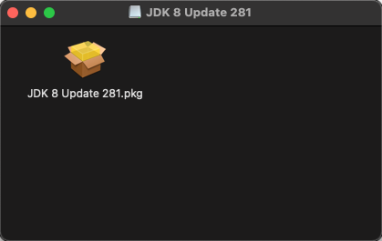

# Java

## macOS

### 安装

对于安装包，无论是 dmg，还是 tar.gz 都可。

比如下载了 dmg 的版本，双击打开，再双击其中的 pkg 文件，然后就是下一步，下一步……




当你电脑安装了第一个 JDK 版本后，比如现在装的是 JDK 11，那么你的 JDK  环境变量就是为 JDK 11了：


哪怕是你接着以同样的方式安装 JDK 1.8，（这时系统软件里会有 1.8 和 11 两个 JDK 软件版本资源）环境变量仍为 JDK 11。

###  切换 JDK 版本

若你需要 JDK 1.8  的环境变量，则需要手动切换，执行命令即可：

```bash
export JAVA_HOME=$(/usr/libexec/java_home -v 1.8)
```

切回 JDK 11，则是

```bash
export JAVA_HOME=$(/usr/libexec/java_home -v 11)
```


切换到其他版本以此类推，只要你有在当前计算机系统内有安装。

查看当前 macOS 系统内安装所有的 JDK 版本

```bash
/usr/libexec/java_home -V
```



对于上图中的 `1.8.281.09 (x86_64) "Oracle Corporation" - "Java" /Library/Internet Plug-Ins/JavaAppletPlugin.plugin/Contents/Home` 并不是 JDK 核心的东西，若觉得不（碍）需（眼）要，可以通过以下命令进行删除

`sudo rm -fr /Library/Internet\ Plug-Ins/JavaAppletPlugin.plugin`

`具体的官方参考链接：`[`🔗`](https://www.java.com/zh-TW/download/help/mac_uninstall_java.html)\`\`



